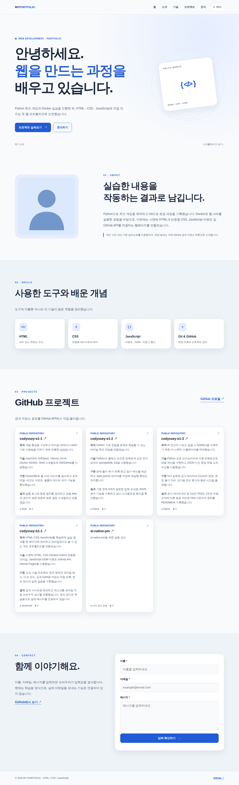
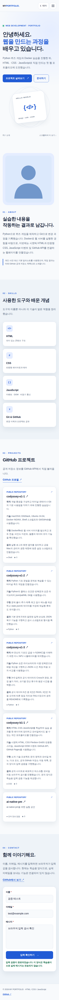
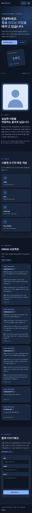

# 코디세이 B1-1 | 나를 소개하는 웹페이지 처음부터 만들기

순수 HTML·CSS·JavaScript로 구현한 반응형 개인 포트폴리오입니다. React/Vue/jQuery 등 외부 UI 라이브러리는 사용하지 않았고 선택 보너스는 제외했습니다. 소개 글과 기본 프로필 일러스트는 학습용 예시입니다.

## 제출 링크

- **GitHub 저장소:** https://github.com/usernameffas/codyssey-b1-1
- **GitHub Pages:** https://usernameffas.github.io/codyssey-b1-1/
- **실제 배포 사이트의 자동 브라우저 QA 및 캡처:** [LIVE_QA.md](docs/screenshots/LIVE_QA.md)
- **실제 화면 캡처 폴더:** [docs/screenshots](docs/screenshots/)

## 제출 스크린샷 — 실제 공개 사이트

아래 세 장은 GitHub Actions의 자동 Chromium 브라우저가 위 **실제 GitHub Pages 주소에 접속해 촬영한 전체 페이지 이미지**입니다. 개발용 모의 API 스크린샷이 아니며, 물리적 PC·삼성 휴대전화의 실기 화면이라고 주장하지 않습니다. 별도로 실제 안드로이드 기기에서 확인한 모바일 화면 3장의 검토 내용은 [QA_REPORT.md](QA_REPORT.md)에 기록했습니다.

**데스크톱 1280px** — [원본 이미지 보기](docs/screenshots/desktop.png)

**모바일 390px** — [원본 이미지 보기](docs/screenshots/mobile.png)

**다크 모드 390px** — [원본 이미지 보기](docs/screenshots/dark.png)

## 파일 구성 및 사용 기술

| 파일 | 역할 |
| --- | --- |
| `index.html` | Header·Hero·About·Skills·Projects·Contact·Footer, 시맨틱 구조 및 폼 |
| `css/style.css` | CSS 변수·Flexbox·Grid·768px/1024px 반응형·테마 |
| `js/main.js` | DOM·이벤트·메뉴·스크롤·테마·GitHub API·입력 검증 |
| `images/profile.svg` | 기본 일러스트 |
| `STUDY_GUIDE.md` | 코드 학습 및 이벤트 → 상태 → 렌더링 설명 |
| `CHECKLIST.md` | 실제 완료 항목 및 코디세이 제출 상태 |
| `QA_REPORT.md` | 개발용 검사와 실제 휴대전화 스크린샷 확인 범위 |
| `docs/screenshots/LIVE_QA.md` | 실제 공개 URL 자동 브라우저 검사 결과 |
| `MOBILE_GUIDE.md` | 안드로이드에서 사이트 실행·확인·제출 방법 |

## 구현한 필수 기능

- 의미 있는 HTML 태그, 여섯 영역, 내부 링크, 이미지 대체 텍스트, 폼 레이블.
- 모바일 우선 디자인 및 768px/1024px 반응형, Flexbox·Grid.
- 햄버거 메뉴의 열림/닫힘과 링크 클릭 시 닫힘, 부드러운 스크롤, 스크롤 시 헤더·위로 가기 버튼.
- 다크 모드 전환 및 `localStorage`에 선택 저장/다시 불러오기.
- `IntersectionObserver` 스크롤 등장 애니메이션.
- `fetch`와 `async/await`로 GitHub 공개 저장소 API 호출; 로딩/성공/빈 목록/오류/요청 제한 처리.
- 이름·이메일·메시지 필수 검증, 잘못된 이메일 안내, 정상 입력 시 검증 완료 메시지.

**문의 양식은 학습용입니다.** 검증에 성공해도 실제 이메일/메시지를 전송하지 않습니다. 전송은 선택 보너스여서 구현하지 않았습니다. GitHub API 토큰과 비밀번호는 코드에 사용하지 않습니다.

## 실행 및 검증

안드로이드에서는 위 Pages URL을 Chrome 또는 삼성 인터넷으로 엽니다. Windows에서는 저장소를 다운로드하여 `index.html`을 VS Code Live Server로 실행할 수 있습니다. Python/Node/Docker 설치 없이 사이트 사용이 가능합니다. 자동 캡처를 위한 Playwright는 GitHub Actions 검사 환경에서만 설치하며 웹사이트 실행 라이브러리가 아닙니다.

- 정적 소스 검사 및 JavaScript 문법 검사 통과.
- Chromium 메모리 실행 + **모의 GitHub API** 기능 검사 19/19 통과(실제 웹사이트 시험과 구분).
- GitHub Pages 빌드·배포 성공.
- 공개 GitHub Pages URL 자동 Chromium 실제 접속: 데스크톱/모바일 HTTP 200, 가로 넘침 없음, 실제 GitHub 저장소 링크 **4개** 표시.
- 실제 사이트에서 모바일 메뉴 열기/선택 후 닫기, 이메일 오류 및 정상 입력 검증, 위로 가기, 다크 모드 새로고침 뒤 유지 확인. 세부 결과는 [LIVE_QA.md](docs/screenshots/LIVE_QA.md).
- 사용자가 제공한 실제 안드로이드 캡처 3장으로 모바일 배치·다크 화면·이메일 형식 오류·위로 가기 버튼 표시를 별도 확인. 이는 모든 기능의 실기 시험을 대체하지 않습니다.

**남은 별도 단계:** 코디세이 과제 제출 화면에 저장소 URL·Pages URL·요구되는 스크린샷을 제출하고 제출 완료 표시 확인. 제출 여부는 [CHECKLIST.md](CHECKLIST.md)에서 별도로 관리합니다.
